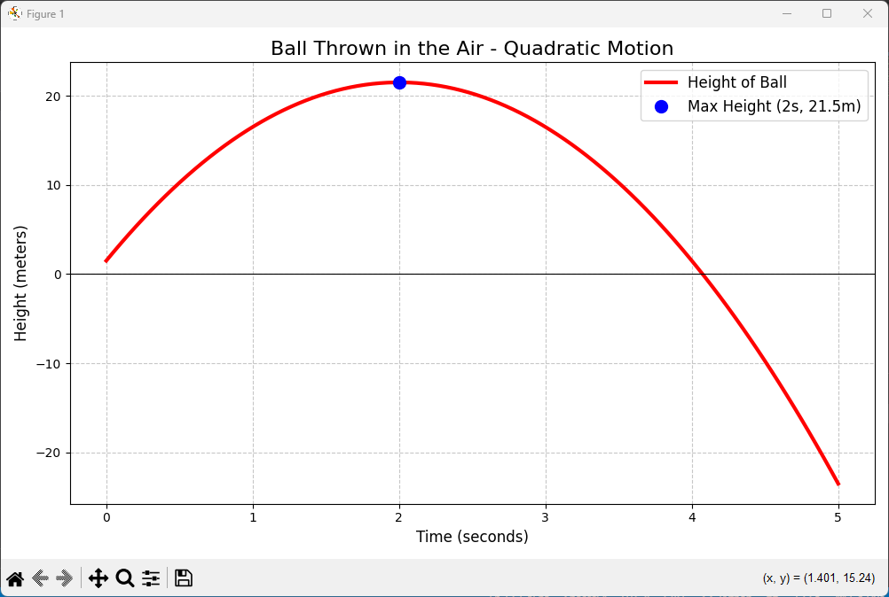

# Quadratic Problem: Ball Height Simulation

This project calculates and visualizes the height of a ball over time using a quadratic equation.

## 📈 Output


## 📄 Files
- `ball_height.py` – Python script that computes and plots ball height
- `quadratic.png` – Sample output graph

## ▶️ How to Run
```bash
python ball_height.py